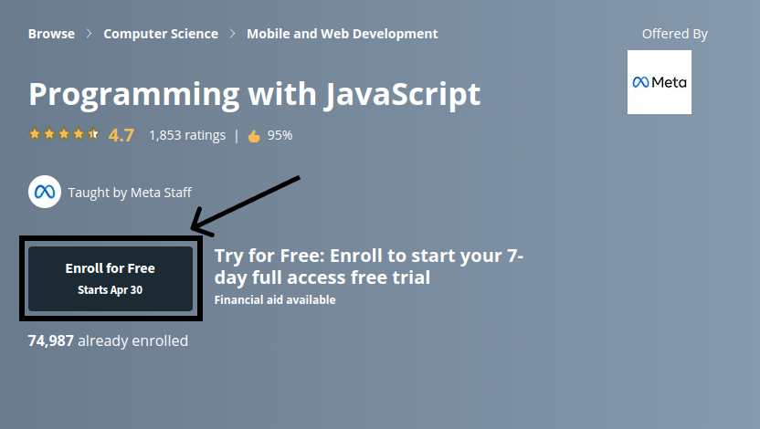

# **Important Note**

this directory is used to store the weekly material of IEEE Student Chapter.

## **How to use this directory**

1. This directory contains two subdirectories: `G1` and `G2`. Each subdirectory contains the material of the corresponding week.
2. Each subdirectory contains a `README.md` file that contains the material of the corresponding week.
3. Each subdirectory contains a `code`, `slides`, `etc` directories - if available - that contains the code of the corresponding week.

## **subdirectories**

[G1](/weeks/G1/), [G2](/weeks/G2/)

## **How to access Coursera courses for free**

1. Go to [Coursera](https://www.coursera.org/) website.
2. Choose the course you want to enroll in.
3. Click on `Enroll for free` button.
4. Click on `Audit the course` button.
5. Enjoy learning.

